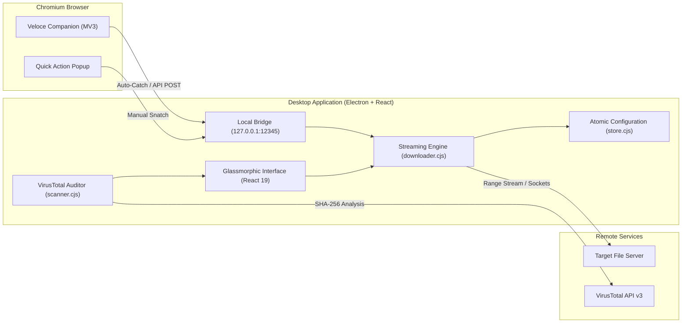

<p align="center">
  
</p>

<h1 align="center">Veloce Download Manager</h1>

<p align="center">
  <strong>High-performance desktop download accelerator and security auditor with native Chromium browser integration.</strong>
</p>

<p align="center">
  
  
  
  
  
</p>

<p align="center">
  
</p>

---

## Overview

Veloce Download Manager is an engineered desktop download accelerator designed for speed, resilience, and security. Built with Electron and React, Veloce couples deep network streaming optimizations with an intuitive glassmorphic dashboard and a companion Chromium browser extension (Manifest V3).

Veloce intercepts high-volume downloads, orchestrates parallel byte-range streams, throttles background tasks dynamically based on queue priority, and conducts automated hash-based threat verification using VirusTotal.

---

## Key Capabilities

- **High-Throughput Streaming Engine**: Handles HTTP byte-range requests with automatic resume capabilities, streaming backpressure management, and drop-connection detection.
- **Native Browser Companion**: Manifest V3 extension intercepts downloads from Google Chrome, Brave, Edge, and other Chromium browsers via local IPC loopback.
- **Intelligent Bandwidth Scheduling**: Automatically assigns unrestricted bandwidth to top-priority transfers while intelligently pacing background items.
- **Automated Threat Intelligence**: Scans downloaded files against 70+ antivirus and threat intelligence engines via the integrated VirusTotal v3 API.
- **Universal Ingestion**: Catch downloads via browser triggers, automated system clipboard detection, or direct manual URL submission.
- **Smart Categorization**: Organizes downloads into dedicated directories (Images, Videos, Audio, Documents, Software) based on MIME types and file signatures.
- **Hardened Local Security**: Bound strictly to `127.0.0.1` with explicit cross-origin validation to prevent unauthorized network or browser access.

---

## System Architecture



---

## Installation & Setup

### 1. Desktop Application

1. Download the latest installer `Veloce-DM-Setup-1.0.0.exe` or standalone portable package from the Releases section.
2. Run the installer or extract the portable folder to your desired location.
3. Launch Veloce Download Manager. The local receiver service will automatically start on `127.0.0.1:12345`.

### 2. Browser Companion Extension

The extension integrates Chromium browsers with the desktop engine:

1. Download `Veloce-Chrome-Companion-1.0.0.zip` from Releases and extract it to a persistent local folder.
2. In Google Chrome, navigate to `chrome://extensions/`.
3. Enable **Developer mode** using the toggle in the upper-right corner.
4. Click **Load unpacked** and select the extracted extension directory.
5. The Veloce icon will appear in your browser toolbar, confirming active connection to the desktop client.

### 3. Configuring Interception Rules

By default, the companion extension intercepts downloads matching configured URL prefixes:

1. In the Veloce desktop application, open **Settings**.
2. Under **Browser Integration**, add domain or URL prefixes (for example, `https://releases.ubuntu.com/` or `https://cdn.example.com/`).
3. Alternatively, toggle **Catch All Downloads** in the browser extension popup to intercept every file download automatically.
4. The extension also includes a **Catch Current Download** button to snatch in-progress browser transfers instantly.

---

## Building from Source

### Prerequisites

- Node.js 18.0 or later
- npm 9.0 or later
- Windows 10/11 (for NSIS packaging)

### Build Commands

```bash
# Clone the repository
git clone https://github.com/lapisecek/Download-Manager-Pro.git
cd Download-Manager-Pro

# Install dependencies
npm install

# Run automated engine verification tests
npm run test:engine

# Run linter
npm run lint

# Run in development mode (Vite + Electron)
npm run electron:dev

# Build production bundle and Windows executable
npm run build:exe
```

---

## Security Model

Veloce enforces defense-in-depth principles:

- **Strict Loopback Binding**: The internal Express receiver binds exclusively to `127.0.0.1`. It never listens on `0.0.0.0`, protecting against unauthorized access from local area networks.
- **Origin Validation**: Strict CORS headers restrict incoming requests to browser extension IDs and local loopback callers, blocking foreign website exploitation.
- **Path Traversal Protection**: All inbound filenames undergo sanitization, stripping illegal characters and directory traversal markers (`../`) prior to filesystem writes.
- **Blob & Data URI Bypassing**: In-browser client-generated exports (`blob:`, `data:`) are intentionally bypassed to prevent data loss.

---

## Specifications

| Specification | Detail |
| :--- | :--- |
| **Target OS** | Windows 10 / 11 (x64) |
| **Extension Standard** | Manifest V3 |
| **API Loopback Ports** | 12345 (Fallback: 12346, 12347) |
| **Security Scanning** | SHA-256 Hash Matching via VirusTotal v3 |
| **Renderer Architecture** | React 19, Lucide Icons, DnD-Kit, Vite 8 |
